## About the Project

**CoffeeAgntcy** is a reference implementation based on a fictitious coffee company to help developers understand how components in the **AGNTCY Internet of Agents** ecosystem can work together. It gives examples of the components of AGNTCY working together as a **Multi-agent System (MAS)**.

## System Architecture

### Lungo Multi-Agent System Overview

```mermaid
graph TB
    subgraph UI_LAYER["🖥️ User Interface Layer"]
        UI[React UI<br/>Port 3000]
    end
    
    subgraph API_LAYER["🔌 API Gateway Layer"]
        API[Exchange Server<br/>FastAPI Port 8000]
    end
    
    subgraph FARM_AGENTS["🌱 Coffee Farm Agents"]
        BRAZIL[☕ Brazil Farm<br/>Port 9999]
        COLOMBIA[☕ Colombia Farm<br/>Port 9998]
        VIETNAM[☕ Vietnam Farm<br/>Port 9997]
    end
    
    subgraph LOGISTICS["📦 Logistics Agents"]
        SUPERVISOR[👔 Supervisor]
        FARM_LOG[🚜 Farm Logistics]
        SHIPPER[🚚 Shipper]
        ACCOUNTANT[💰 Accountant]
        HELPDESK[📞 Helpdesk]
    end
    
    subgraph MCP_LAYER["🔧 MCP Services"]
        WEATHER[🌤️ Weather MCP<br/>Port 8125]
        PAYMENT[💳 Payment MCP<br/>Port 8081]
    end
    
    subgraph TRANSPORT["🔄 Message Transport"]
        SLIM[SLIM Transport<br/>Port 46357]
        NATS[NATS Broker<br/>Ports 4222-4223]
    end
    
    subgraph OBSERVABILITY["📊 Data & Observability"]
        CLICKHOUSE[ClickHouse DB<br/>Ports 8123, 9000]
        OTEL[OpenTelemetry<br/>Ports 4317-4318]
        GRAFANA[Grafana<br/>Port 3001]
    end
    
    UI -->|HTTP| API
    API -->|A2A| SLIM
    
    SLIM <-->|Broadcast| BRAZIL
    SLIM <-->|Broadcast| COLOMBIA
    SLIM <-->|Broadcast| VIETNAM
    SLIM <-->|A2A| SUPERVISOR
    SLIM <-->|A2A| FARM_LOG
    SLIM <-->|A2A| SHIPPER
    SLIM <-->|A2A| ACCOUNTANT
    SLIM <-->|A2A| HELPDESK
    
    COLOMBIA -->|Weather Data| WEATHER
    ACCOUNTANT -->|Payment| PAYMENT
    
    BRAZIL -->|Traces| OTEL
    COLOMBIA -->|Traces| OTEL
    VIETNAM -->|Traces| OTEL
    API -->|Traces| OTEL
    
    OTEL -->|Store| CLICKHOUSE
    GRAFANA -->|Query| CLICKHOUSE
    
    SUPERVISOR -.->|Pub/Sub| NATS
    FARM_LOG -.->|Pub/Sub| NATS
    
    style UI fill:#667eea,stroke:#764ba2,stroke-width:3px,color:#fff
    style API fill:#f093fb,stroke:#f5576c,stroke-width:3px,color:#fff
    
    style BRAZIL fill:#11998e,stroke:#38ef7d,stroke-width:3px,color:#fff
    style COLOMBIA fill:#11998e,stroke:#38ef7d,stroke-width:3px,color:#fff
    style VIETNAM fill:#11998e,stroke:#38ef7d,stroke-width:3px,color:#fff
    
    style SUPERVISOR fill:#fa709a,stroke:#fee140,stroke-width:2px,color:#fff
    style FARM_LOG fill:#fa709a,stroke:#fee140,stroke-width:2px,color:#fff
    style SHIPPER fill:#fa709a,stroke:#fee140,stroke-width:2px,color:#fff
    style ACCOUNTANT fill:#fa709a,stroke:#fee140,stroke-width:2px,color:#fff
    style HELPDESK fill:#fa709a,stroke:#fee140,stroke-width:2px,color:#fff
    
    style WEATHER fill:#ff6b6b,stroke:#ee5a6f,stroke-width:3px,color:#fff
    style PAYMENT fill:#ff6b6b,stroke:#ee5a6f,stroke-width:3px,color:#fff
    
    style SLIM fill:#4facfe,stroke:#00f2fe,stroke-width:4px,color:#fff
    style NATS fill:#43e97b,stroke:#38f9d7,stroke-width:3px,color:#fff
    
    style CLICKHOUSE fill:#fa8bff,stroke:#2bd2ff,stroke-width:3px,color:#fff
    style OTEL fill:#fccb90,stroke:#d57eeb,stroke-width:3px,color:#fff
    style GRAFANA fill:#a8edea,stroke:#fed6e3,stroke-width:3px,color:#333
    
    style UI_LAYER fill:#f8f9fa,stroke:#667eea,stroke-width:2px
    style API_LAYER fill:#f8f9fa,stroke:#f093fb,stroke-width:2px
    style FARM_AGENTS fill:#f8f9fa,stroke:#11998e,stroke-width:2px
    style LOGISTICS fill:#f8f9fa,stroke:#fa709a,stroke-width:2px
    style MCP_LAYER fill:#f8f9fa,stroke:#ff6b6b,stroke-width:2px
    style TRANSPORT fill:#f8f9fa,stroke:#4facfe,stroke-width:2px
    style OBSERVABILITY fill:#f8f9fa,stroke:#fa8bff,stroke-width:2px
```

### Agent Communication Flow

```mermaid
sequenceDiagram
    autonumber
    participant 👤 User
    participant 🖥️ UI as React UI
    participant 🔌 Exchange as Exchange API
    participant 🔄 SLIM as SLIM Transport
    participant ☕ Brazil as Brazil Farm
    participant ☕ Colombia as Colombia Farm
    participant ☕ Vietnam as Vietnam Farm
    participant 🌤️ Weather as Weather MCP

    rect rgb(102, 126, 234)
    Note over 👤 User,🖥️ UI: User Interaction
    👤 User->>🖥️ UI: Request farm inventories
    🖥️ UI->>🔌 Exchange: POST /agent/prompt
    end
    
    rect rgb(79, 172, 254)
    Note over 🔌 Exchange,🔄 SLIM: Broadcast Phase
    🔌 Exchange->>🔄 SLIM: Broadcast request to all farms
    end
    
    rect rgb(17, 153, 142)
    Note over 🔄 SLIM,☕ Vietnam: Parallel Agent Processing
    par Brazil Processing
        🔄 SLIM->>☕ Brazil: Get inventory
        ☕ Brazil-->>🔄 SLIM: 450,000 lbs ✅
    and Colombia Processing
        🔄 SLIM->>☕ Colombia: Get inventory
        ☕ Colombia->>🌤️ Weather: Get weather data
        🌤️ Weather-->>☕ Colombia: Forecast data 🌤️
        ☕ Colombia-->>🔄 SLIM: 6,500 lbs (calculated) ✅
    and Vietnam Processing
        🔄 SLIM->>☕ Vietnam: Get inventory
        ☕ Vietnam-->>🔄 SLIM: 1,800,000 lbs ✅
    end
    end
    
    rect rgb(240, 147, 251)
    Note over 🔄 SLIM,👤 User: Response Aggregation
    🔄 SLIM-->>🔌 Exchange: Aggregated responses
    🔌 Exchange-->>🖥️ UI: Combined inventory data
    🖥️ UI-->>👤 User: Display results 📊
    end
```

### Data Flow Architecture

```mermaid
flowchart LR
    subgraph INPUT["📥 Input Sources"]
        A[👤 User Prompts]
        B[🔧 MCP Servers]
    end
    
    subgraph AGENTS["🤖 Agent Processing"]
        C[🧠 LangGraph Agents]
        D[🎯 LLM Provider<br/>OpenAI/Anthropic/Groq]
    end
    
    subgraph COMM["💬 Communication Layer"]
        E[🔄 SLIM Transport]
        F[📡 A2A Protocol]
    end
    
    subgraph OBS["📊 Observability Pipeline"]
        G[📈 OpenTelemetry]
        H[💾 ClickHouse]
        I[📊 Grafana]
    end
    
    A -->|Requests| C
    B -->|External Data| C
    C <-->|LLM Calls| D
    C <-->|Messages| E
    E <-->|A2A| F
    C -->|Traces| G
    G -->|Store| H
    H -->|Query| I
    
    style A fill:#667eea,stroke:#764ba2,stroke-width:3px,color:#fff
    style B fill:#ff6b6b,stroke:#ee5a6f,stroke-width:3px,color:#fff
    
    style C fill:#11998e,stroke:#38ef7d,stroke-width:4px,color:#fff
    style D fill:#f093fb,stroke:#f5576c,stroke-width:3px,color:#fff
    
    style E fill:#4facfe,stroke:#00f2fe,stroke-width:4px,color:#fff
    style F fill:#43e97b,stroke:#38f9d7,stroke-width:3px,color:#fff
    
    style G fill:#fccb90,stroke:#d57eeb,stroke-width:3px,color:#fff
    style H fill:#fa8bff,stroke:#2bd2ff,stroke-width:3px,color:#fff
    style I fill:#a8edea,stroke:#fed6e3,stroke-width:3px,color:#333
    
    style INPUT fill:#f8f9fa,stroke:#667eea,stroke-width:3px
    style AGENTS fill:#f8f9fa,stroke:#11998e,stroke-width:3px
    style COMM fill:#f8f9fa,stroke:#4facfe,stroke-width:3px
    style OBS fill:#f8f9fa,stroke:#fa8bff,stroke-width:3px
```

### Component Stack

```mermaid
graph TB
    subgraph APP["🎨 Application Layer"]
        A1[⚛️ React Frontend<br/>Vite + TypeScript]
        A2[⚡ FastAPI Backend<br/>Python 3.12]
    end
    
    subgraph FRAMEWORK["🧠 Agent Framework"]
        B1[🔄 LangGraph<br/>State Management]
        B2[⛓️ LangChain<br/>LLM Orchestration]
        B3[📡 A2A SDK v0.3.0<br/>Agent Protocol]
    end
    
    subgraph TRANSPORT["🌐 Transport & Messaging"]
        C1[🔄 SLIM v0.6.1<br/>Agent Transport]
        C2[📨 NATS v2.11.8<br/>Message Broker]
        C3[🔧 MCP v1.10.0+<br/>Model Context]
    end
    
    subgraph OBSERVABILITY["📊 Observability & Data"]
        D1[👁️ ioa-observe-sdk v1.0.24<br/>Tracing]
        D2[📈 OpenTelemetry<br/>Telemetry]
        D3[💾 ClickHouse<br/>Time-Series DB]
        D4[📊 Grafana<br/>Visualization]
    end
    
    subgraph INFRA["⚙️ Infrastructure"]
        E1[🐳 Docker Compose<br/>20 Services]
        E2[🐍 Python 3.12<br/>Runtime]
        E3[📦 Node.js 16+<br/>Frontend Build]
        E4[⚡ uv Package Manager<br/>Dependencies]
    end
    
    A1 -->|Uses| B1
    A2 -->|Uses| B1
    B1 -->|Built on| B2
    B2 -->|Implements| B3
    B3 -->|Transports via| C1
    B3 -->|Pub/Sub via| C2
    B3 -->|Context via| C3
    B1 -->|Traces to| D1
    D1 -->|Sends to| D2
    D2 -->|Stores in| D3
    D3 -->|Displays in| D4
    
    E1 -.->|Runs| A1
    E1 -.->|Runs| A2
    E2 -.->|Executes| B1
    E3 -.->|Builds| A1
    E4 -.->|Manages| B1
    
    style A1 fill:#667eea,stroke:#764ba2,stroke-width:3px,color:#fff
    style A2 fill:#f093fb,stroke:#f5576c,stroke-width:3px,color:#fff
    
    style B1 fill:#11998e,stroke:#38ef7d,stroke-width:3px,color:#fff
    style B2 fill:#11998e,stroke:#38ef7d,stroke-width:3px,color:#fff
    style B3 fill:#11998e,stroke:#38ef7d,stroke-width:3px,color:#fff
    
    style C1 fill:#4facfe,stroke:#00f2fe,stroke-width:3px,color:#fff
    style C2 fill:#43e97b,stroke:#38f9d7,stroke-width:3px,color:#fff
    style C3 fill:#ff6b6b,stroke:#ee5a6f,stroke-width:3px,color:#fff
    
    style D1 fill:#fccb90,stroke:#d57eeb,stroke-width:3px,color:#fff
    style D2 fill:#fccb90,stroke:#d57eeb,stroke-width:3px,color:#fff
    style D3 fill:#fa8bff,stroke:#2bd2ff,stroke-width:3px,color:#fff
    style D4 fill:#a8edea,stroke:#fed6e3,stroke-width:3px,color:#333
    
    style E1 fill:#fa709a,stroke:#fee140,stroke-width:3px,color:#fff
    style E2 fill:#fa709a,stroke:#fee140,stroke-width:3px,color:#fff
    style E3 fill:#fa709a,stroke:#fee140,stroke-width:3px,color:#fff
    style E4 fill:#fa709a,stroke:#fee140,stroke-width:3px,color:#fff
    
    style APP fill:#f8f9fa,stroke:#667eea,stroke-width:3px
    style FRAMEWORK fill:#f8f9fa,stroke:#11998e,stroke-width:3px
    style TRANSPORT fill:#f8f9fa,stroke:#4facfe,stroke-width:3px
    style OBSERVABILITY fill:#f8f9fa,stroke:#fa8bff,stroke-width:3px
    style INFRA fill:#f8f9fa,stroke:#fa709a,stroke-width:3px
```

This reference agentic application demonstrates how to:

- How **SLIM** enables **request-reply** , **unicast (fire & forget)** and **group communication** patterns.
- How tools and transports can be reused across agent implementations (e.g., **SLIM**, **NATS**, **MCP**)
- How protocol-agnostic bridges and clients interconnect modular agents
- How to orchestrate agents using **LangGraph** for structured, stateful workflows with streaming support
- How to write **A2A** client and server agents
- How to integrate data sources (e.g., weather services via **MCP**)
- How to extend or swap agents modularly using AGNTCY tooling
- How to enable observability using **AGNTCY Observe SDK**
- How to enable identity using **AGNTCY Identity Service SDK**

---

### Setups Included

We currently provide two setups you can run to see how components from AGNTCY work together — one simple two-agent use case and the other a more complex MAS:

- **Corto**:  
  A two-agent, ready-to-run setup that highlights core agent interactions using agent-to-agent (A2A) messaging via configurable transports(default: AGNTCY's SLIM). Agents are orchestrated within a LangGraph. It also shows how to enable observability using Observe SDK.

  👉 [View the Corto README](coffeeAGNTCY/coffee_agents/corto)

- **Lungo**:  
  A more advanced setup that will evolve over time as we mature components. There are two setups: 1) pub/sub A2A over NATS as default transport along with streaming support, and 2) group communication over SLIM as default along with streaming support. Agents are structured as directed LangGraphs with A2A communication using configurable transports. It includes an MCP weather-aware farm that fetches live data, observability via the Observe SDK, identity, and a group communication pattern with specialized agents (farms, shipper, accountant) that collaborate to fulfill coffee orders.

  👉 [View the Lungo README](coffeeAGNTCY/coffee_agents/lungo)

---

### Built With

- [AGNTCY App SDK](https://github.com/agntcy/app-sdk) = v0.4.1
- [SLIM](https://github.com/agntcy/slim) = v0.6.1
- [NATS](https://github.com/nats-io/nats-server) = v2.11.8
- [A2A](https://github.com/a2aproject/a2a-python) = v0.3.0
- [MCP](https://github.com/modelcontextprotocol/python-sdk) >= v1.10.0
- [LangGraph](https://github.com/langchain-ai/langgraph) >= v0.4.1
- [Observe SDK](https://github.com/agntcy/observe) = 1.0.24
- [AGNTCY Identity Service SDK](https://github.com/agntcy/identity-service) = 0.0.6

---

## Contributing

This is a developer-facing reference repo. If you're building agentic systems—or interested in shaping the future of distributed agents—we'd love your feedback, contributions, or collaboration. Contributions are what make the open-source community such an amazing place to learn, inspire, and create. For detailed contributing guidelines, please see [CONTRIBUTING.md](CONTRIBUTING.md).

---

## License

Distributed under the Apache-2.0 License. See [LICENSE](LICENSE) for more information.

## Acknowledgements

- The [AGNTCY](https://github.com/agntcy) project.
